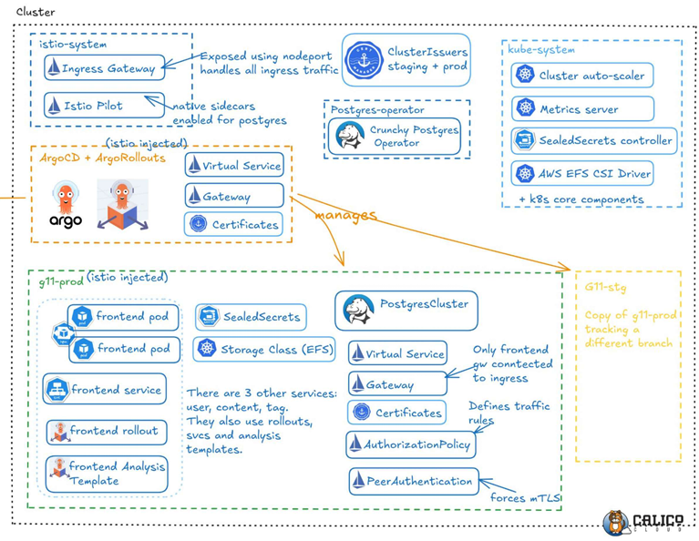

# Architecture

Comprehensive system architecture covering Kubernetes cluster setup, AWS infrastructure, security, and authentication integration.

## Kubernetes Cluster Architecture

### Istio Service Mesh
- Ingress Gateway: Exposes services using nodeport, handles all ingress traffic
- Istio Pilot: Native sidecars injected for pod-to-pod communication
- Virtual Service: Manages traffic routing
- Gateway: Handles ingress configuration
- Certificates: TLS certificate management

### Cluster Core Components
- **kube-system**: Kubernetes system components
- **cluster-autoscaler**: Auto-scales cluster based on demand
- **metrics-server**: Collects resource metrics
- **SealedSecrets-controller**: Manages encrypted secrets
- **AWS EFS CSI Driver**: Integrates AWS EFS storage

### Data Layer
- **Postgres Operator**: Manages CrunchyPostgres database operator
- **PostgresCluster**: Primary data store for the platform

### Production Namespace (g11-prod - istio injected)
- Frontend pods with rolling updates
- Frontend service and rollout configuration
- Frontend Analysis template for metrics
- User, content, and comment services
- SealedSecrets for sensitive data
- Storage Class (EFS) for persistent storage
- Virtual Service and Gateway for traffic management
- Certificates for secure communication
- AuthorizationPolicy for service-to-service security
- PeerAuthentication: Enforces mTLS

### Staging Namespace (g11-stg)
- Separate environment for testing deployments
- Identical setup to production for consistency

## AWS Infrastructure

### Domain & DNS
- **Porkbun**: Domain registrar
- **Route 53**: AWS DNS service with NS records pointing to AWS
- **DWS**: Domain routing configured

### Network
- **VPC**: Virtual Private Cloud containing all infrastructure
- **NLB (Network Load Balancer)**: Handles TLS and auto-upgrades HTTP to HTTPS
- **Internet Gateway**: Provides external connectivity

### Compute
- **Master Node**: Control plane with IAM permissions for resource management
- **Worker Nodes (EC2)**: Auto-scaling group of EC2 instances
- **Auto Scaling Group**: Handles cluster scaling based on demand
- **EFS (Elastic File System)**: Persistent storage mounted via AWS EFS CSI Driver

### Storage & Security
- **S3 Buckets**:
  - Terraform bucket: Stores infrastructure state
  - Certs bucket: Holds certificates and scripts
- **IAM**: Manages permissions and access control

## Asgardeo Integration

### Blog Platform Authentication Flow
- **Frontend App** ↔ **User Service** ↔ **Asgardeo**
- **OIDC SSO**: User Login, ID Token Issue, JWKS Endpoint
- **SCIM2 Management**: User Lock/Unlock, Status Sync

### Hybrid Authentication Design
- **Asgardeo** → Handles authentication only
- **Local DB** → Manages blog roles (Admin, Editor, Reader)
- Enables future flexibility (IAM decoupled from app logic)

### Just-In-Time (JIT) Provisioning
- First-time login → Automatic user creation
- Assigned default "Reader" role
- Admin Panel built for role upgrades & account control

## Architecture Design

### AWS Architecture (Terraform)
- Infrastructure provisioned using Terraform
- Scalable AWS resources for the blog platform

### K8s Architecture (GitOps, Helm)
- Kubernetes deployment managed via GitOps
- Helm charts for application packaging and deployment

### Security Measures
- **Strict mTLS**: Service to service and pod to pod traffic within production and staging namespaces have mTLS strictly enforced, including postgres data and rollouts
- **SealedSecrets**: Used to securely store secrets in the GitOps repo
- **TLS**: Certificates generated using cert-manager, connections automatically upgraded to HTTPS
- **AuthorizationPolicies**: Rules for service to service endpoints, restricting all by default and allowing specific interactions
- **Zero Trust**: Comprehensive security model implemented