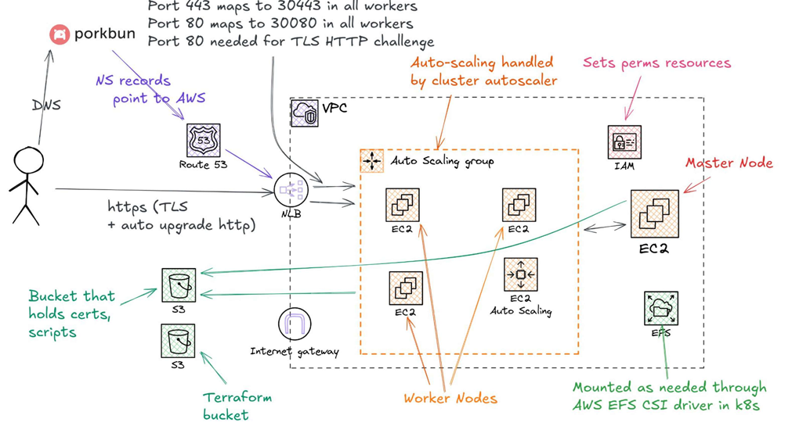

# Infrastructure

## AWS Architecture (Terraform)

Infrastructure as Code using Terraform for automated provisioning and management of AWS resources.

### Domain & DNS
- **Porkbun**: External domain registrar
- **Route 53**: AWS DNS service
  - NS records point to AWS Route 53
  - Domain routing configured for cluster access

### Network Architecture
- **VPC (Virtual Private Cloud)**: Isolated network environment
- **NLB (Network Load Balancer)**: 
  - Handles all incoming traffic
  - Port 443 → 30443 (HTTPS traffic)
  - Port 80 → 30080 (HTTP traffic, redirected to HTTPS)
  - Auto-upgrades HTTP to HTTPS with TLS

### Compute Resources
- **Master Node (Control Plane)**:
  - Manages Kubernetes cluster
  - IAM permissions for resource provisioning
  - Handles certificate management and storage

- **Worker Nodes (EC2 Instances)**:
  - Auto-scaling group manages node count
  - Scales up/down based on cluster demand
  - Multiple instances for high availability

- **Auto Scaling Group**:
  - Automatically scales EC2 instances
  - Based on cluster resource utilization
  - Horizontal scaling for performance

### Storage
- **EFS (Elastic File System)**:
  - Persistent storage for Kubernetes volumes
  - Mounted via AWS EFS CSI Driver
  - Shared across worker nodes

- **S3 Buckets**:
  - **Terraform Bucket**: Stores Terraform state files
  - **Certs Bucket**: Holds TLS certificates and bootstrap scripts

### Security
- **IAM (Identity and Access Management)**:
  - Fine-grained permission management
  - Service roles for different components
  - Encryption and key management

## Terraform Automation

### Infrastructure as Code
- All infrastructure defined in Terraform
- Version-controlled and reproducible deployments
- Automated provisioning of AWS resources

### Key Features
- Modular configuration
- Environment-specific parameters
- State management via S3

## Scaling Architecture

### Vertical Scaling
- Master Node: Increased compute resources
- Worker Node configuration: Enhanced instance types

### Horizontal Scaling
- Auto Scaling Groups: Add/remove EC2 instances
- Cluster Autoscaler: Kubernetes-driven scaling
- Load distribution via NLB

See also: [Architecture](ARCHITECTURE.md) for Kubernetes cluster design, [Kubernetes](KUBERNETES.md) for deployment setup