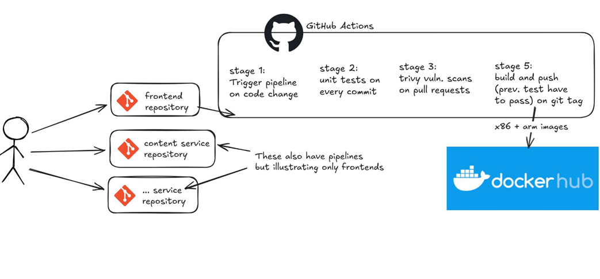

# CI/CD Pipeline

## GitHub Actions Workflow

The CI/CD pipeline is triggered on code changes and follows a 5-stage process:

### Stage 1: Trigger Pipeline
- Activated on code change in repository
- Supported services: frontend-service, content-service, and other services

### Stage 2: Unit Tests
- Unit tests run on every commit
- Ensures code quality and functionality

### Stage 3: Security Scanning
- Trivy VULN scans on pull requests
- Vulnerability detection and reporting

### Stage 4: Build & Push
- Build Docker images
- Push to Docker Hub with x86 and ARM images

### Stage 5: Tag & Release
- Tag commits and create releases
- Previous tests must pass before proceeding

## CI/CD & Security
- Added GitHub Actions workflows for automated build, test, and deploy
- Managed .trivyignore for security scans
- Multi-architecture support (x86 and ARM)
- Vulnerability scanning integrated

## Code CI/CD (CI/CD pt 1.)
- Automated build and testing pipelines
- Docker image creation and push to registry
- Tag-based releases

## GitOps CI/CD (CI/CD pt 2.)
- GitOps approach for deployment automation via [Deployment](DEPLOYMENT.md)
- Rollout strategies and manual approval for production
- Separation of staging and production deployments