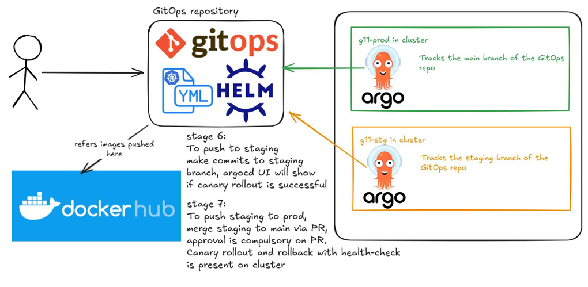

# Deployment

## GitOps Repository Structure

The deployment follows a GitOps model with Helm and ArgoCD:

### Repository Organization
- **Docker Hub**: References pushed Docker images from CI/CD pipeline
- **HELM & YAML**: Infrastructure as Code with Helm templates
- **Stage 6**: Push to staging - Makes commits to staging branch, ArgoCD watches and deploys if canary rollout is successful
- **Stage 7**: Push to production - Merge staging to main via PR, approval required, canary rollout and rollback with health-check on cluster

### Branch Tracking
- **g11-prod** (Production): Tracks the main branch of GitOps repo
- **g11-stg** (Staging): Tracks the staging branch of GitOps repo

## ArgoCD

### Deployment Flow
- ArgoCD watches GitOps repository for changes
- Syncs Kubernetes manifests with actual cluster state
- Provides visibility and control over deployments

### Multi-Environment Setup
- **Production Environment**: g11-prod cluster tracking main branch
- **Staging Environment**: g11-stg cluster tracking staging branch

## ArgoCD Rollouts

### Rollout Strategy
- Canary deployments for gradual rollouts
- Automated rollback on health check failure
- Manual approval gate for production deployments

### Rollout and Rollback
- Canary analysis before full rollout
- Health checks validate deployment success
- Quick rollback capability if issues detected

## Content Service
- ArgoCD integration for testing and deployment purposes
- Follows same GitOps deployment patterns as other services

See also: [CI/CD Pipeline](CICD_PIPELINE.md) for build process, [Architecture](ARCHITECTURE.md) for infrastructure details